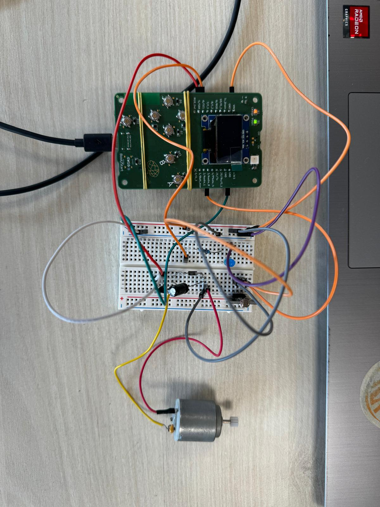
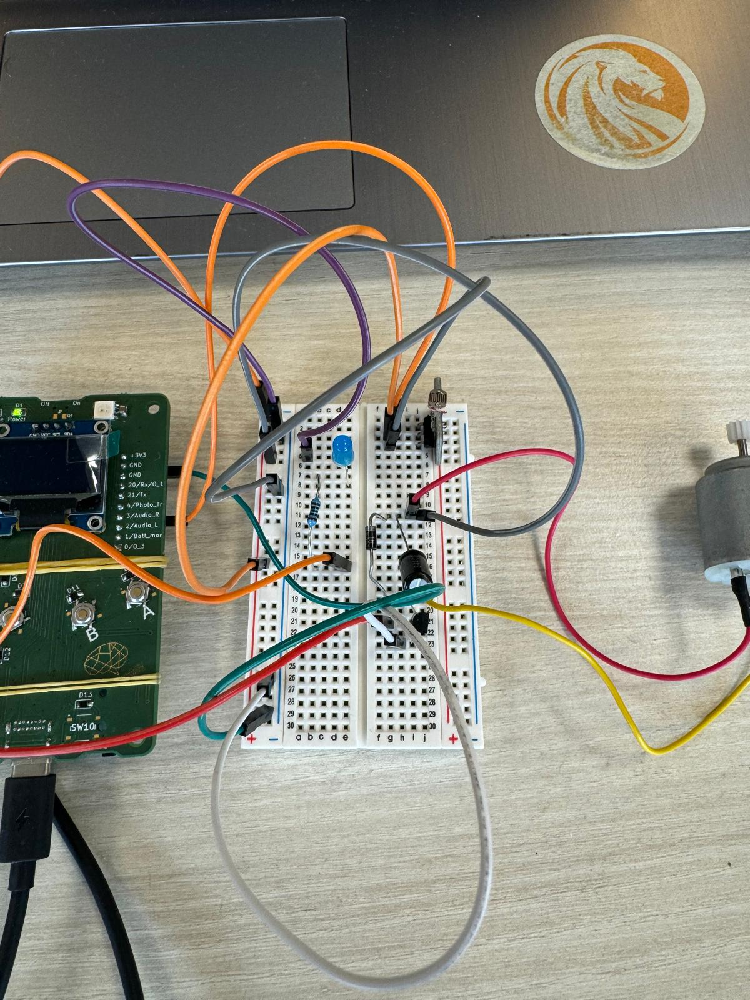
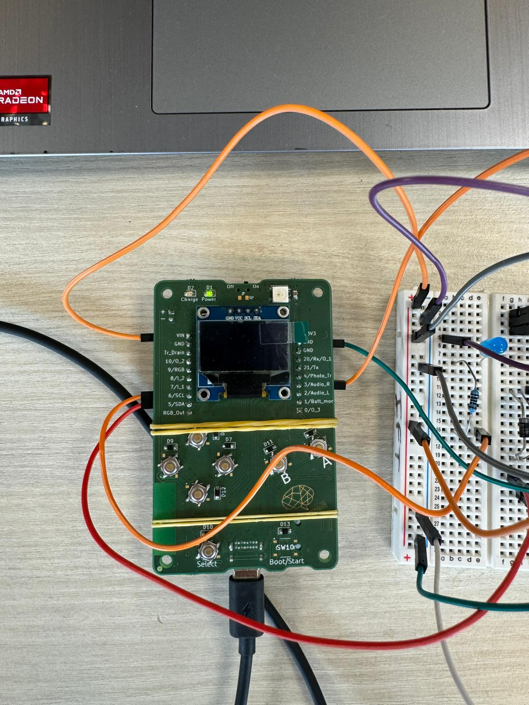
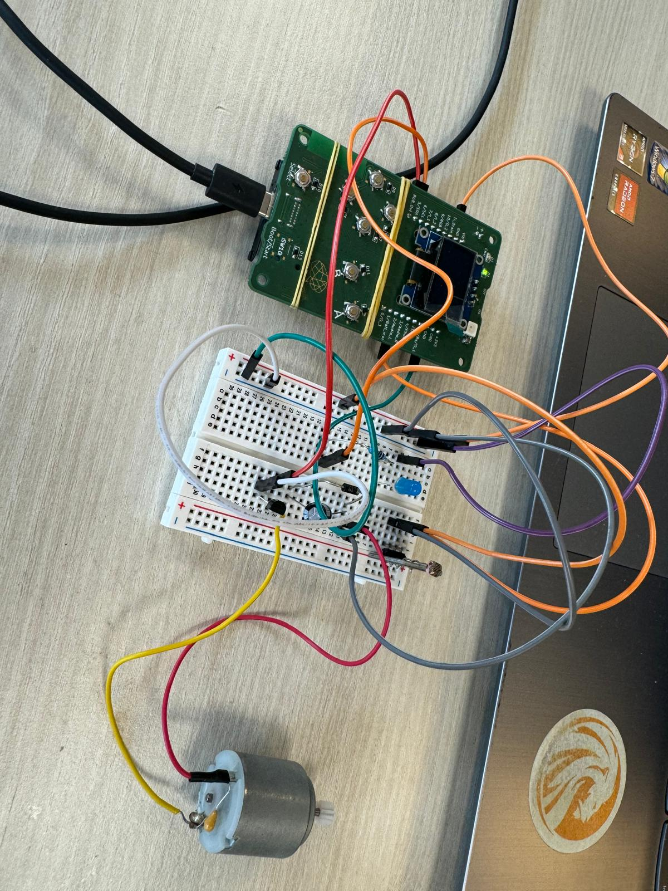

# web_workshop
web_workshop project by Darius Nallet

In this project, I coded a website using HTML, CSS, and JavaScript, which interacts with and receives data from the electronic assembly that I also built. The aim of this project was to experiment with the basics in these fields, allowing me to reuse the skills I’ve learned in the future if needed. The website communicates with the ESP32 on the PCB through a WebSocket, and I programmed the ESP32 using Arduino code. The website features a homepage that leads to a control page, where users can adjust the brightness of an LED in real-time, control a motor, and monitor data from a photoresistor, which sends ambient light information every second. The entire setup is powered by batteries, making the assembly self-sufficient.

Some photos:

Youtube demo:
https://youtu.be/vh7OnH02ZwA

Figma Link:
https://www.figma.com/design/3zHkc8euiRPDNO22LwU5BC/Untitled?node-id=0-1&t=uEI8Hm158HLJk2p2-1
